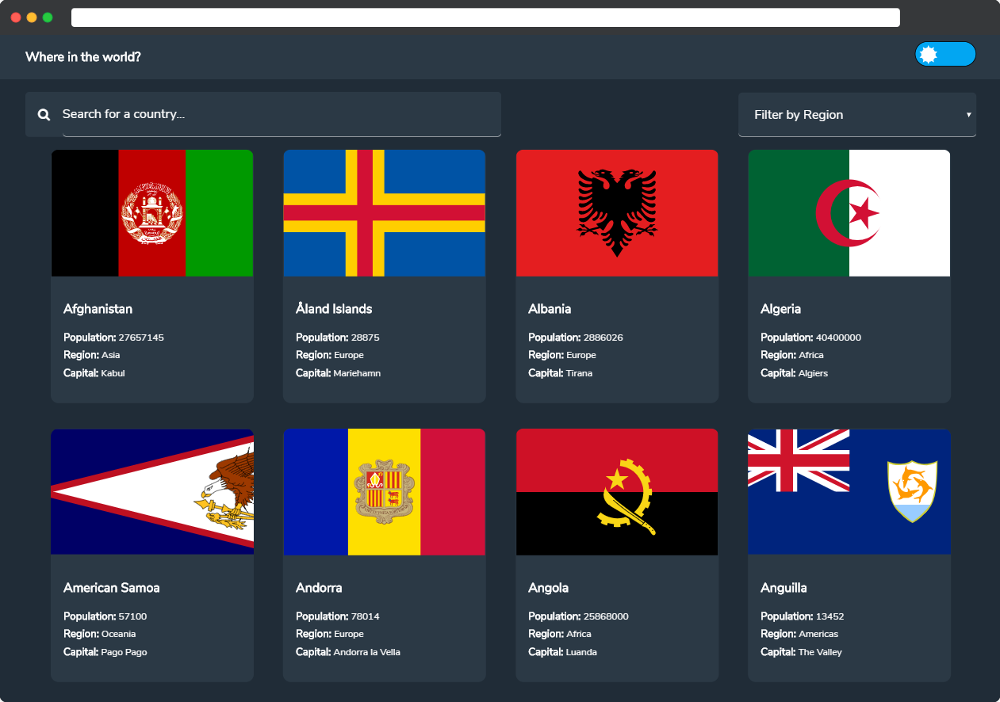
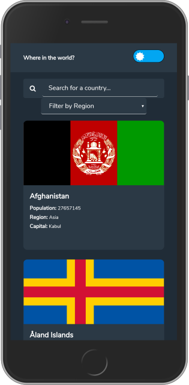

# Countries_API
A REST Countries API with color theme switcher

This project is one of the advanced challenges on the frontendmentor site. Using data from the REST Countries API, I created a page to display selected country information. A theme switcher was also incorporated into the project and localstorage is used to persist information about the theme state on the browser. 

Users can perform the following functions on the app:

- See all countries from the API on the homepage
- Search for a country using an `input` field
- Filter countries by region
- Click on a country to see more detailed information on a separate page
- Click through to the border countries on the detail page
- Toggle the color scheme between light and dark mode

No Javascript framework was used on the frontend. 

## Screenshots

## Live Demo

[Hosted Link](https://festive-agnesi-5093de.netlify.app)

## Author

Longe Temitope
- Github: [@tamsay](https://github.com/tamsay)
- Twitter: [@longetope](https://twitter.com/longetope)

## 🤝 Contributing

Contributions, issues and feature requests are welcome!

Feel free to check the [issues page](https://github.com/tamsay/countries_api/issues)

## Show your support

Give a ⭐️ if you like this project!

## Acknowledgments

Project inspired by [Frontend Mentor](https://www.frontendmentor.io/)
